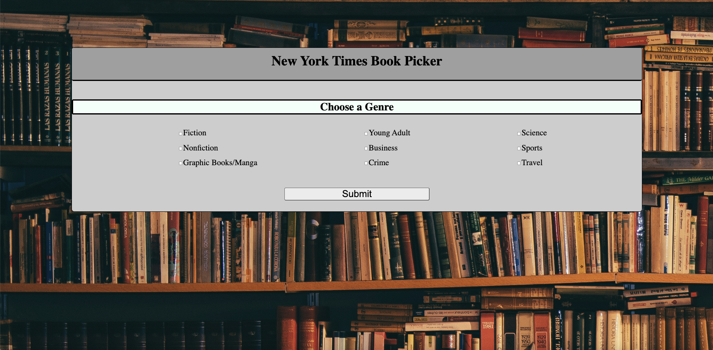
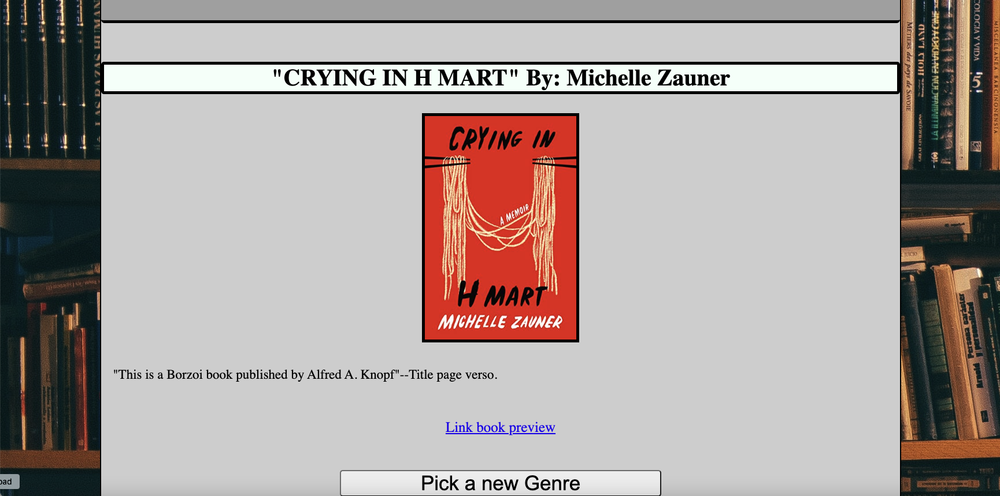

# The Book Picker
This application allows the user to choose from nine different genre options, and generates a random book that is currently on The New York Times Best Sellers List. 
The user is allowed to select more than one genre at a time: Fiction, Nonfiction, Graphic Books/Manga, Young Adult, Business, Crime, Science, Sports, Travel. Recent Suggestions at the bottom right of the application will show you the past three searches that have been ran. The application pulls data from  two different API's, The New York Times API & Google Books API.
## Badges
There are no images that require lscensing and all coding methods were those taught in the Vandebilt Web Development Bootcamp.
## Authors
- [@Brad-Hambrick](https://www.github.com/Brad-Hambrick)
- [@ockkorson](https://www.github.com/ckkorson)
- [@davidgreenhouse](https://www.github.com/davidgreenhouse)
- [@mccaskillk](https://www.github.com/mccaskillk)
## Deployed Application
To deploy this project:
  https://ckkorson.github.io/movie-night/
## Visuals

## Support
@mccaskillalexk@gmail.com
@bradleyhambrick@gmail.com
@dgreenhouse96@gmail.com
@caleb.k.korson@gmail.com
## License
The background image did not require a license. 
Contributions: /* Photo by <a href="https://unsplash.com/@alfonsmc10?utm_source=unsplash&utm_medium=referral&utm_content=creditCopyText">Alfons Morales</a> on <a href="https://unsplash.com/s/photos/library-books?utm_source=unsplash&utm_medium=referral&utm_content=creditCopyText">Unsplash</a> */
    /* Photo by Alfons Morales */
## Roadmap
This project can be expanded in many different ways. First off, we can open up the question sets offered for the generator. We could give options of book rating, weeks on the bestseller list, etc. From there, we can expand the project to move into Movies, TV, Music etc. We can help a world full of indecisive people never have to make a decision again when it comes to their entertainment.